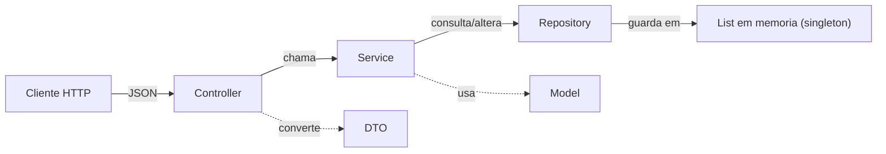
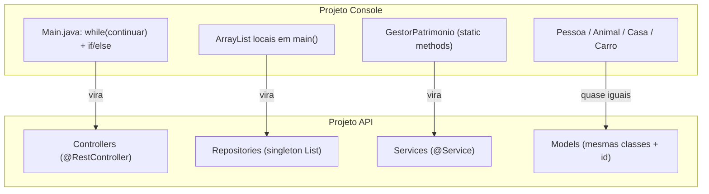

# Sistema Familia — API REST

> Versao em **API REST (Spring Boot 3)** do projeto console [`sistema-familia`](../sistema-familia/). Mesmas regras de negocio, mesmas classes de modelo, mas servidas por HTTP em vez de menu de terminal.

[](https://www.oracle.com/java/)
[](https://spring.io/projects/spring-boot)
[](https://maven.apache.org/)

---

## Sumario

- [Objetivo Didatico](#objetivo-didatico)
- [Arquitetura em Camadas](#arquitetura-em-camadas)
- [Equivalencia: Console -> API](#equivalencia-console---api)
- [Estrutura de Pastas](#estrutura-de-pastas)
- [Como Executar](#como-executar)
- [Swagger UI](#swagger-ui)
- [Mapeamento Menu -> Endpoints](#mapeamento-menu---endpoints)
- [Documentacao Completa dos Endpoints](#documentacao-completa-dos-endpoints)
- [Como a Interatividade Vira Payload](#como-a-interatividade-vira-payload)
- [Padronizacao de Erros](#padronizacao-de-erros)
- [Fluxo Completo de Teste (cURL)](#fluxo-completo-de-teste-curl)
- [Onde Foi Cada Pedaco do Codigo Antigo?](#onde-foi-cada-pedaco-do-codigo-antigo)

---

## Objetivo Didatico

Esta API foi escrita para mostrar ao aluno **o mesmo codigo de negocio funcionando em estrutura de API**. Compare lado a lado:

| Projeto Console (`sistema-familia`) | Projeto API (`sistema-familia-api`) |
|---|---|
| `Main.java` com `while(continuar)` + `if/else` para cada opcao | **Controllers** (`@RestController`) — um endpoint para cada opcao |
| `ArrayList<Pessoa> familia` dentro do `main()` | **Repositories** (`@Repository`) — listas em memoria singleton |
| `GestorPatrimonio` com metodos `static` | **Services** (`@Service`) — mesma logica, sem `Scanner` nem `System.out` |
| `Pessoa`, `Animal`, `Casa`, `Carro` | Mesmas classes, agora com `id` e atributos `private` (encapsulamento) |
| Validacao manual (`if (nome.isBlank())`) | **`jakarta.validation`** com `@NotBlank`, `@Min`, `@Positive` |
| `System.out.println("Valor invalido")` | Excecoes (`BusinessException`, `NotFoundException`) -> JSON com codigo HTTP |
| `confirmarAcao("S/N")` | Proprio envio da requisicao ja e a confirmacao |

---

## Arquitetura em Camadas



- **Controller**: recebe HTTP, valida payload, chama o Service e devolve JSON.
- **Service**: regras de negocio (substitui o `GestorPatrimonio` do console).
- **Repository**: estrutura estatica em memoria (substitui os `ArrayList` locais do `Main`).
- **Model**: as mesmas classes `Pessoa`, `Animal`, `Casa`, `Carro` do projeto original.
- **DTO**: objetos que entram (`*Request`) e saem (`*Response`) da API — evitam vazar referencia interna (ex.: `Pessoa dono` vira `donoId` + `donoNome` no JSON).

---

## Equivalencia: Console -> API



---

## Estrutura de Pastas

```
sistema-familia-api/
|-- pom.xml
|-- README.md
`-- src/main/
    |-- java/com/altzen/familia/api/
    |   |-- SistemaFamiliaApiApplication.java    # main() Spring Boot
    |   |-- model/
    |   |   |-- Pessoa.java
    |   |   |-- Animal.java
    |   |   |-- Casa.java
    |   |   `-- Carro.java
    |   |-- repository/                          # listas em memoria (singletons)
    |   |   |-- PessoaRepository.java
    |   |   |-- AnimalRepository.java
    |   |   |-- CasaRepository.java
    |   |   `-- CarroRepository.java
    |   |-- service/                             # regras de negocio
    |   |   |-- PessoaService.java
    |   |   |-- AnimalService.java
    |   |   |-- CasaService.java
    |   |   |-- CarroService.java
    |   |   `-- GestorPatrimonioService.java     # transferencias e divida
    |   |-- controller/                          # endpoints REST
    |   |   |-- PessoaController.java
    |   |   |-- AnimalController.java
    |   |   |-- CasaController.java
    |   |   `-- CarroController.java
    |   |-- dto/                                 # objetos de entrada e saida
    |   |   |-- PessoaRequest.java / PessoaResponse.java
    |   |   |-- AnimalRequest.java / AnimalResponse.java
    |   |   |-- CasaRequest.java / CasaResponse.java
    |   |   |-- CarroRequest.java / CarroResponse.java
    |   |   |-- AtribuirDonoRequest.java
    |   |   |-- TransferenciaRequest.java / TransferenciaResponse.java
    |   |   |-- PagamentoDividaRequest.java / PagamentoDividaResponse.java
    |   |   `-- PatrimonioResponse.java
    |   `-- exception/
    |       |-- BusinessException.java
    |       |-- NotFoundException.java
    |       |-- ErroResponse.java
    |       `-- GlobalExceptionHandler.java      # @RestControllerAdvice
    `-- resources/
        `-- application.properties
```

---

## Como Executar

### Pre-requisitos

- JDK **17+** instalado
- Maven **3.6+** instalado

### Subir o servidor

```bash
mvn spring-boot:run
```

A API sobe em `http://localhost:8080/api`.

### (Alternativo) Empacotar e rodar o JAR

```bash
mvn clean package
java -jar target/sistema-familia-api-1.0-SNAPSHOT.jar
```

---

## Swagger UI

Apos subir o servidor, abra:

```
http://localhost:8080/api/swagger-ui.html
```

O Swagger lista **todos os endpoints**, permite enviar requisicoes de teste pelo navegador (sem precisar de Postman/Insomnia) e mostra os schemas de cada Request/Response. Use-o para explorar a API.

---

## Mapeamento Menu -> Endpoints

A tabela abaixo mostra como cada opcao do menu original virou um endpoint REST. Os caminhos sao relativos ao prefixo `/api`.

| # | Opcao do Menu | Metodo | Endpoint |
|---|---|---|---|
| 1 | Cadastrar pessoa | `POST` | `/pessoas` |
| 2 | Cadastrar animal | `POST` | `/animais` |
| 3 | Cadastrar casa | `POST` | `/casas` |
| 4 | Cadastrar carro | `POST` | `/carros` |
| 5 | Listar familia | `GET` | `/pessoas` |
| 6 | Listar animais | `GET` | `/animais` |
| 7 | Listar casas | `GET` | `/casas` |
| 8 | Listar carros | `GET` | `/carros` |
| 9 | Ver patrimonio | `GET` | `/pessoas/{id}/patrimonio` |
| 10 | Atribuir proprietario (animal) | `PUT` | `/animais/{id}/dono` |
| 10 | Atribuir proprietario (casa) | `PUT` | `/casas/{id}/dono` |
| 10 | Atribuir proprietario (carro) | `PUT` | `/carros/{id}/dono` |
| 11 | Transferir casa (com possivel emprestimo) | `POST` | `/casas/{id}/transferencia` |
| 12 | Transferir carro (com possivel emprestimo) | `POST` | `/carros/{id}/transferencia` |
| 13 | Transferir animal (sem custo) | `POST` | `/animais/{id}/transferencia` |
| 14 | Pagar divida | `POST` | `/pessoas/{id}/pagamento-divida` |
| 15 | Sair | -- | nao se aplica (o servidor fica no ar) |

---

## Documentacao Completa dos Endpoints

### Pessoas

| Endpoint | Descricao |
|---|---|
| `POST /pessoas` | Cadastra uma pessoa nova. Body: `PessoaRequest`. |
| `GET /pessoas` | Lista todas as pessoas. |
| `GET /pessoas/{id}` | Busca uma pessoa pelo id. |
| `GET /pessoas/{id}/patrimonio` | Calcula patrimonio liquido (animais + casas + carros + carteira - divida). |
| `POST /pessoas/{id}/pagamento-divida` | Paga parte/toda a divida. Body: `PagamentoDividaRequest`. |

`PessoaRequest`:
```json
{
  "nome": "Pai",
  "idade": 45,
  "parentesco": "Pai",
  "carteira": 5000.00
}
```

### Animais

| Endpoint | Descricao |
|---|---|
| `POST /animais` | Cadastra um animal. Body: `AnimalRequest`. |
| `GET /animais` | Lista todos os animais. |
| `GET /animais/{id}` | Busca um animal pelo id. |
| `PUT /animais/{id}/dono` | Atribui dono novo (sem custo). Body: `AtribuirDonoRequest`. |
| `POST /animais/{id}/transferencia` | Transferencia de animal (sem custo). Body: `TransferenciaRequest`. |

`AnimalRequest`:
```json
{
  "nome": "Rex",
  "idade": 3,
  "especie": "Cachorro",
  "donoId": 1
}
```

### Casas

| Endpoint | Descricao |
|---|---|
| `POST /casas` | Cadastra uma casa (valor > 0; dono deve ter >= 18 anos). Body: `CasaRequest`. |
| `GET /casas` | Lista todas as casas. |
| `GET /casas/{id}` | Busca uma casa pelo id. |
| `PUT /casas/{id}/dono` | Atribui dono novo (sem custo). Body: `AtribuirDonoRequest`. |
| `POST /casas/{id}/transferencia` | Vende a casa para outra pessoa (com possivel emprestimo). Body: `TransferenciaRequest`. |

`CasaRequest`:
```json
{
  "nome": "Casa de praia",
  "idade": 10,
  "endereco": "Av. Beira-Mar, 100",
  "valor": 200000.00,
  "donoId": 1
}
```

### Carros

| Endpoint | Descricao |
|---|---|
| `POST /carros` | Cadastra um carro (valor > 0; dono deve ter >= 18 anos). Body: `CarroRequest`. |
| `GET /carros` | Lista todos os carros. |
| `GET /carros/{id}` | Busca um carro pelo id. |
| `PUT /carros/{id}/dono` | Atribui dono novo (sem custo). Body: `AtribuirDonoRequest`. |
| `POST /carros/{id}/transferencia` | Vende o carro para outra pessoa (com possivel emprestimo). Body: `TransferenciaRequest`. |

`CarroRequest`:
```json
{
  "nome": "Corolla",
  "idade": 2,
  "marca": "Toyota",
  "valor": 95000.00,
  "donoId": 1
}
```

---

## Como a Interatividade Vira Payload

No console, o metodo `executarVenda` perguntava interativamente:
1. "Deseja contratar emprestimo? (S/N)"
2. "Confirmar venda? (S/N)"

Em uma API REST nao temos um terminal aberto para conversar. Entao:

- A pergunta sobre emprestimo vira um **campo do JSON** (`aceitaEmprestimo`).
- A confirmacao final **e o proprio envio da requisicao** (nao precisa confirmar de novo).

`TransferenciaRequest`:
```json
{
  "novoDonoId": 2,
  "aceitaEmprestimo": true
}
```

Comportamento:
- Se o comprador tem saldo total -> `aceitaEmprestimo` e ignorado e a venda e a vista.
- Se falta dinheiro e `aceitaEmprestimo=false` -> `422 Unprocessable Entity` com mensagem clara.
- Se falta dinheiro e `aceitaEmprestimo=true` -> debita o que o comprador tem + soma a diferenca na divida + credita o vendedor (mesma logica do `executarVenda` original).

---

## Padronizacao de Erros

Todo erro devolve um JSON no formato:

```json
{
  "timestamp": "2026-06-29T20:15:33.123",
  "status": 422,
  "erro": "Regra de negocio violada",
  "mensagem": "Saldo insuficiente: faltam R$ 199000,00. Reenvie com 'aceitaEmprestimo=true'..."
}
```

| Codigo | Quando acontece | Vem de |
|---|---|---|
| `400 Bad Request` | Campo invalido no payload (`@NotBlank`, `@Positive`, etc.) | `MethodArgumentNotValidException` |
| `404 Not Found` | Id de pessoa/animal/casa/carro nao existe | `NotFoundException` |
| `422 Unprocessable Entity` | Regra de negocio (menor de idade, mesmo dono, sem saldo, sem divida...) | `BusinessException` |
| `500 Internal Server Error` | Erro inesperado | qualquer outra `Exception` |

Tudo isso e centralizado em [`GlobalExceptionHandler`](src/main/java/com/altzen/familia/api/exception/GlobalExceptionHandler.java) com `@RestControllerAdvice`.

---

## Fluxo Completo de Teste (cURL)

> Lembre-se: o prefixo da API e `/api` (definido em `application.properties`).

### 1. Cadastrar familia

```bash
curl -X POST http://localhost:8080/api/pessoas \
  -H "Content-Type: application/json" \
  -d '{"nome":"Pai","idade":45,"parentesco":"Pai","carteira":5000}'

curl -X POST http://localhost:8080/api/pessoas \
  -H "Content-Type: application/json" \
  -d '{"nome":"Mae","idade":40,"parentesco":"Mae","carteira":3000}'

curl -X POST http://localhost:8080/api/pessoas \
  -H "Content-Type: application/json" \
  -d '{"nome":"Filho","idade":22,"parentesco":"Filho","carteira":1000}'
```

### 2. Cadastrar uma casa do Pai (id=1)

```bash
curl -X POST http://localhost:8080/api/casas \
  -H "Content-Type: application/json" \
  -d '{"nome":"Casa de praia","idade":10,"endereco":"Av. Beira-Mar","valor":200000,"donoId":1}'
```

### 3. Listar a familia

```bash
curl http://localhost:8080/api/pessoas
```

### 4. Tentar transferir a casa para o Filho (id=3) sem aceitar emprestimo

```bash
curl -X POST http://localhost:8080/api/casas/1/transferencia \
  -H "Content-Type: application/json" \
  -d '{"novoDonoId":3,"aceitaEmprestimo":false}'
```

Resposta `422`:
```json
{
  "status": 422,
  "erro": "Regra de negocio violada",
  "mensagem": "Saldo insuficiente: faltam R$ 199000,00. Reenvie com 'aceitaEmprestimo=true' para contratar emprestimo sem juros pelo valor restante."
}
```

### 5. Aceitar o emprestimo

```bash
curl -X POST http://localhost:8080/api/casas/1/transferencia \
  -H "Content-Type: application/json" \
  -d '{"novoDonoId":3,"aceitaEmprestimo":true}'
```

Resposta:
```json
{
  "tipoBem": "casa",
  "bemId": 1,
  "bemNome": "Casa de praia",
  "valorBem": 200000.0,
  "vendedor": "Pai",
  "comprador": "Filho",
  "valorPago": 1000.0,
  "valorEmprestimo": 199000.0,
  "carteiraVendedorApos": 205000.0,
  "carteiraCompradorApos": 0.0,
  "dividaCompradorApos": 199000.0,
  "mensagem": "Venda concluida! Casa \"Casa de praia\" agora pertence a Filho."
}
```

### 6. Consultar patrimonio do Pai (vendedor) e do Filho (comprador)

```bash
curl http://localhost:8080/api/pessoas/1/patrimonio
curl http://localhost:8080/api/pessoas/3/patrimonio
```

### 7. Filho recebe um aumento e paga parte da divida

```bash
# (etapas omitidas: somar saldo na carteira; em uma API real seria via outro endpoint
#  como POST /pessoas/{id}/credito; aqui o aluno pode evoluir e implementar)

curl -X POST http://localhost:8080/api/pessoas/3/pagamento-divida \
  -H "Content-Type: application/json" \
  -d '{"valor":500}'
```

---

## Onde Foi Cada Pedaco do Codigo Antigo?

Para o aluno se localizar no novo projeto, esta tabela mapeia o codigo do projeto console para o codigo da API:

| Codigo Console | Codigo API |
|---|---|
| `Main.java` (loop e menu) | Divide-se em [`PessoaController`](src/main/java/com/altzen/familia/api/controller/PessoaController.java), [`AnimalController`](src/main/java/com/altzen/familia/api/controller/AnimalController.java), [`CasaController`](src/main/java/com/altzen/familia/api/controller/CasaController.java), [`CarroController`](src/main/java/com/altzen/familia/api/controller/CarroController.java) |
| `ArrayList<Pessoa> familia` (local) | [`PessoaRepository`](src/main/java/com/altzen/familia/api/repository/PessoaRepository.java) (singleton) |
| `ArrayList<Animal> animais` (local) | [`AnimalRepository`](src/main/java/com/altzen/familia/api/repository/AnimalRepository.java) |
| `ArrayList<Casa> casas` (local) | [`CasaRepository`](src/main/java/com/altzen/familia/api/repository/CasaRepository.java) |
| `ArrayList<Carro> carros` (local) | [`CarroRepository`](src/main/java/com/altzen/familia/api/repository/CarroRepository.java) |
| `Pessoa#exibirDados()` (console) | Substituido por [`PessoaResponse.from(...)`](src/main/java/com/altzen/familia/api/dto/PessoaResponse.java) (JSON) |
| `Pessoa#exibirPatrimonio(...)` | Substituido por [`PessoaService#calcularPatrimonio(...)`](src/main/java/com/altzen/familia/api/service/PessoaService.java) -> retorna [`PatrimonioResponse`](src/main/java/com/altzen/familia/api/dto/PatrimonioResponse.java) |
| `GestorPatrimonio#executarVenda(...)` | [`GestorPatrimonioService#executarVenda(...)`](src/main/java/com/altzen/familia/api/service/GestorPatrimonioService.java) — sem `Scanner`/`System.out`, lanca `BusinessException` |
| `GestorPatrimonio#transferirCasa/Carro/Animal` | `GestorPatrimonioService#transferirCasa/Carro/Animal` |
| `GestorPatrimonio#atribuirProprietario(...)` | Dividido em `atribuirDonoAnimal/Casa/Carro` no service, expostos via `PUT /{recurso}/{id}/dono` |
| `GestorPatrimonio#pagarDivida(...)` | `GestorPatrimonioService#pagarDivida(...)` exposto em `POST /pessoas/{id}/pagamento-divida` |
| `GestorPatrimonio#confirmarAcao("S/N")` | **Removido** — em REST o envio da requisicao ja e a confirmacao |
| `System.out.println("...invalido")` | Substituido por `throw new BusinessException(...)` -> handler global devolve JSON |
| `Main#lerInteiroPositivo / lerDoubleNaoNegativo` | Substituido por anotacoes Jakarta (`@Min(0)`, `@Positive`, `@PositiveOrZero`) nos DTOs `*Request` |

---

## Proximos Passos (sugeridos para o aluno)

- Adicionar `PUT /pessoas/{id}` e `DELETE /pessoas/{id}` para editar e remover.
- Trocar as listas em memoria por **Spring Data JPA + H2** para persistir entre execucoes.
- Escrever testes com `@SpringBootTest` cobrindo `GestorPatrimonioService` (especialmente `executarVenda`).
- Adicionar autenticacao (`spring-boot-starter-security`).
- Versionar a API (`/api/v1/...`).

---

## Licenca

Projeto educacional desenvolvido na mentoria **AltzenPro**. Uso livre para fins didaticos.
